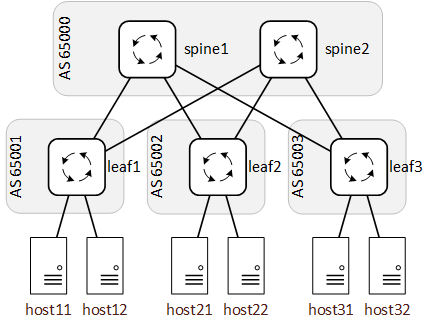

# Spine-Leaf Data Centre Topology using FRRouting

This lab example consists of five [FRR](https://frrouting.org/) routers connected in a spine-leaf topology (two spine and three leaf). Each leaf router is connected to two hosts.


{ width=8cm}


## Requirements

To use this lab, you need to install [containerlab](https://containerlab.srlinux.dev/) (I used the [script method](https://containerlab.srlinux.dev/install/#install-script) Ubuntu 20.04 VM). You also need to have basic familiarity with [Docker](https://www.docker.com/).


## Starting and ending the lab

Use the following command to start the lab:

```
sudo clab deploy --topo bgp-frr.clab.yml
```

For convenience, use the following script to test connectivity between leaf routers and hosts:

```
./router_connect_test.sh
```

and to test connectivity between hosts:

```
./host_connect_test.sh
```

To end the lab:

```
sudo clab destroy --topo bgp-frr.clab.yml
```

## Try this

1. Confirm that BGP sessions are established among all peers.  

   ```
   $ docker exec clab-bgp_frr-spine1 vtysh -c "show bgp summary"
   ```

2. Show the routes learned from BGP in the routing table. Notices there are two paths to each host.

   ```
   $ docker exec clab-bgp_frr-leaf1 vtysh -c "show ip route bgp"
   ```

3. Ping from any one host to another to verify connectivity.

    ```
    $ docker exec clab-bgp_frr-host11 ping 192.168.31.2
    ```

4. Use MTR/traceroute tools to observe the traffic path. Use MTR between several host pairs to confirm that paths are split between the two spine routers.

    ```
    $ docker exec -it clab-bgp_frr-host11 mtr 192.168.31.2
    ```

5. There are two paths between any pair of servers. To observe how the network reacts in case of a link failure:
    a) use MTR to observe the traffic route between two servers, then
    b) disable one of the links in the route and observe the traffic resume over another route.

    ```
    $ docker exec -it clab-bgp_frr-spine1 vtysh
    ```

6. To force traffic to avoid one spine router (e.g. before shutting it down for repairs), prepend the path advertised by the router using a route-map. Add the following lines to the configuration:

    ```
    route-map SERVICE permit 10
     set as-path prepend 65000 65000
    router bgp 65000
     neighbor LEAF route-map SERVICE out
    ```

    Repeat (2) to confirm there only one route to each destination.

7. Use iperf to send TCP traffic between hosts (requires *nicolaka/netshoot* image):
   a) Run iperf as a server in one host

   ```
   docker exec -d clab-bgp_frr-host11 iperf -s
   ```

   b) Run iperf as a client from another host

   ```
   docker exec -it clab-bgp_frr-host31 iperf -c 192.168.11.2
   ```

## Selected output

```
$ docker exec clab-bgp_frr-spine1 vtysh -c "show bgp summary"
% Can't open configuration file /etc/frr/vtysh.conf due to 'No such file or directory'.

IPv4 Unicast Summary (VRF default):
BGP router identifier 10.10.10.11, local AS number 65000 vrf-id 0
BGP table version 6
RIB entries 11, using 2024 bytes of memory
Peers 3, using 2148 KiB of memory
Peer groups 1, using 64 bytes of memory

Neighbor        V         AS   MsgRcvd   MsgSent   TblVer  InQ OutQ  Up/Down State/PfxRcd   PfxSnt Desc
eth1            4      65001        19        20        0    0    0 00:00:39            2        6 N/A
eth2            4      65002        17        18        0    0    0 00:00:36            2        6 N/A
eth3            4      65003        18        19        0    0    0 00:00:36            2        6 N/A

Total number of neighbors 3
```


```
$ docker exec clab-bgp_frr-leaf1 vtysh -c "show ip route bgp"
% Can't open configuration file /etc/frr/vtysh.conf due to 'No such file or directory'.
Codes: K - kernel route, C - connected, S - static, R - RIP,
       O - OSPF, I - IS-IS, B - BGP, E - EIGRP, N - NHRP,
       T - Table, v - VNC, V - VNC-Direct, A - Babel, F - PBR,
       f - OpenFabric,
       > - selected route, * - FIB route, q - queued, r - rejected, b - backup
       t - trapped, o - offload failure

B>* 192.168.21.0/24 [20/0] via fe80::a8c1:abff:fe99:55b0, eth2, weight 1, 00:02:58
  *                        via fe80::a8c1:abff:feab:3957, eth1, weight 1, 00:02:58
B>* 192.168.22.0/24 [20/0] via fe80::a8c1:abff:fe99:55b0, eth2, weight 1, 00:02:58
  *                        via fe80::a8c1:abff:feab:3957, eth1, weight 1, 00:02:58
B>* 192.168.31.0/24 [20/0] via fe80::a8c1:abff:fe99:55b0, eth2, weight 1, 00:02:59
  *                        via fe80::a8c1:abff:feab:3957, eth1, weight 1, 00:02:59
B>* 192.168.32.0/24 [20/0] via fe80::a8c1:abff:fe99:55b0, eth2, weight 1, 00:02:59
  *                        via fe80::a8c1:abff:feab:3957, eth1, weight 1, 00:02:59
```

```
$ docker exec clab-bgp_frr-host11 ping 192.168.31.2
PING 192.168.31.2 (192.168.31.2) 56(84) bytes of data.
64 bytes from 192.168.31.2: icmp_seq=1 ttl=61 time=0.262 ms
64 bytes from 192.168.31.2: icmp_seq=2 ttl=61 time=0.174 ms
...
```

```
$ docker exec -it clab-bgp_frr-host11 mtr 192.168.31.2
My traceroute  [v0.94]
host11 (192.168.11.2) -> 192.168.31.2                                              2022-02-26T23:27:21+0000
Keys:  Help   Display mode   Restart statistics   Order of fields   quit
                                                                Packets               Pings
Host                                                            Loss%   Snt   Last   Avg  Best  Wrst StDev
1. 192.168.11.1                                                  0.0%    12    0.7   0.3   0.2   0.7   0.1
2. 10.10.10.12                                                   0.0%    12    0.3   0.5   0.2   0.9   0.3
3. 10.10.10.23                                                   0.0%    12    0.3   0.3   0.2   0.3   0.0
4. 192.168.31.2                                                  0.0%    12    0.2   0.2   0.2   0.3   0.0
```

```
$ docker exec clab-bgp_frr-leaf1 vtysh -c "show ip route bgp"
% Can't open configuration file /etc/frr/vtysh.conf due to 'No such file or directory'.
Codes: K - kernel route, C - connected, S - static, R - RIP,
       O - OSPF, I - IS-IS, B - BGP, E - EIGRP, N - NHRP,
       T - Table, v - VNC, V - VNC-Direct, A - Babel, F - PBR,
       f - OpenFabric,
       > - selected route, * - FIB route, q - queued, r - rejected, b - backup
       t - trapped, o - offload failure

B>* 192.168.21.0/24 [20/0] via fe80::a8c1:abff:fe99:55b0, eth2, weight 1, 00:02:44
B>* 192.168.22.0/24 [20/0] via fe80::a8c1:abff:fe99:55b0, eth2, weight 1, 00:02:44
B>* 192.168.31.0/24 [20/0] via fe80::a8c1:abff:fe99:55b0, eth2, weight 1, 00:02:44
B>* 192.168.32.0/24 [20/0] via fe80::a8c1:abff:fe99:55b0, eth2, weight 1, 00:02:44
```
